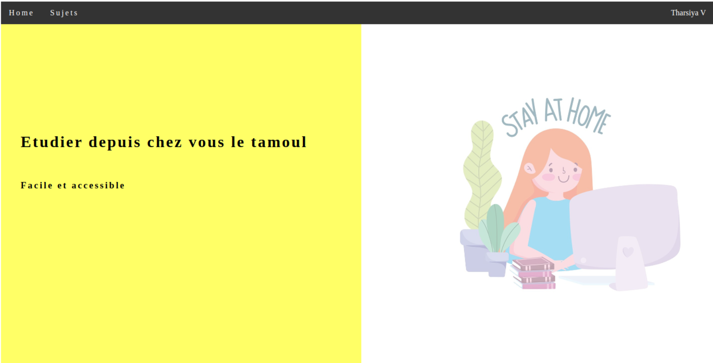
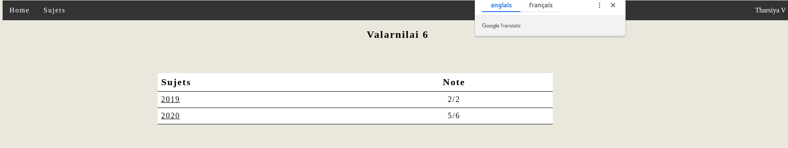
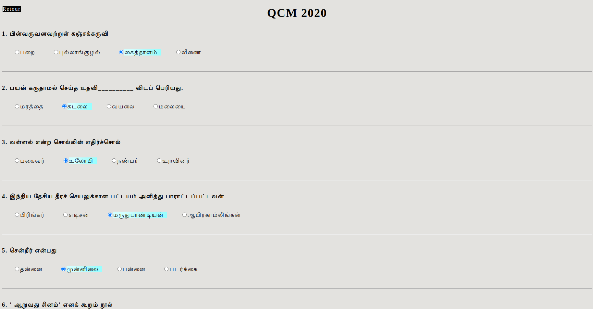
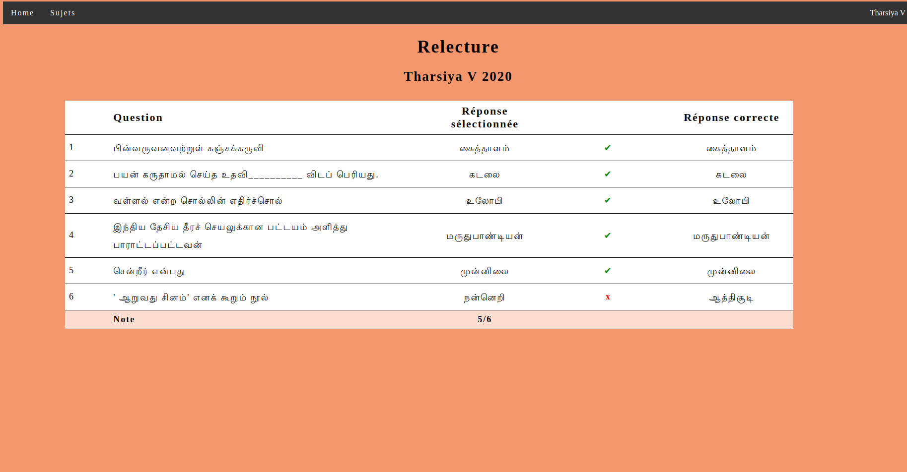
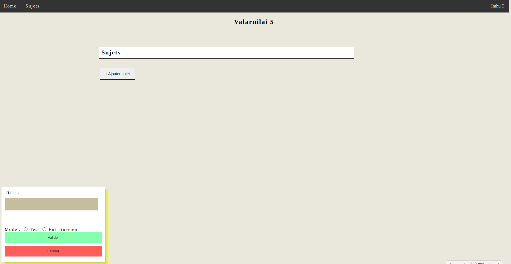
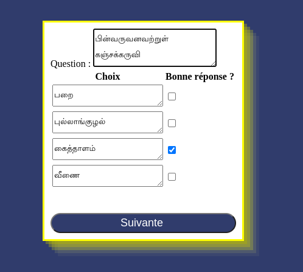
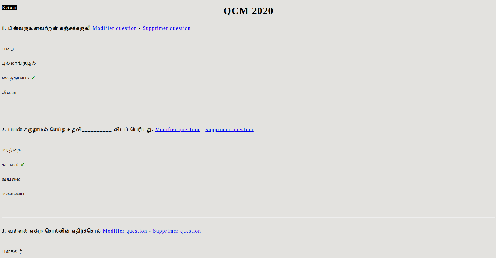
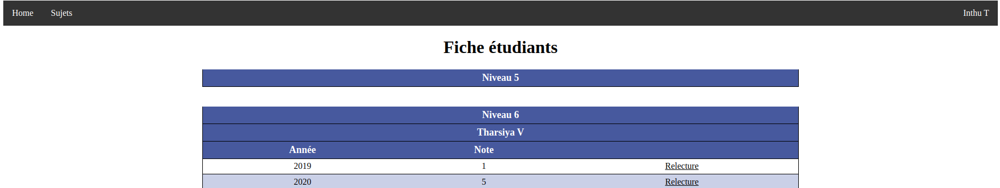

# Inthutamoul

Projet créé en 2020 pour permettre aux élèves de l’association TamoulCholai d’étudier le tamoul depuis chez eux.

## Côté élève

L’élève sera amené.e vers une page où il trouvera une liste de sujets qu’il peut refaire un nombre illimité de fois (seul le dernier résultat sera mis en mémoire). En cliquant sur un sujet, on obtient une page avec les questions comme ci-dessous.

Une fois le QCM rempli validé, l’étudiant est amené.e vers une page avec la correction de son exercice. Il pourra voir à la fois la réponse qu’il/elle a sélectionné et la réponse correcte à la question.

## Côté professeur

Le.a professeur.e peut créer un sujet grâce à un formulaire

Le.a professeur.e a ensuite un récapitulatif des questions qu’il.elle a créé. Il.Elle peut modifier ou supprimer une question.

Le.a professeur.e a accès aux résultats et réponses données par ses élèves

Le lien relecture mène vers la page comme pour l’étudiant avec un tableau qui récapitule les questions, les réponses sélectionnées par l’élève et les réponses correctes.
